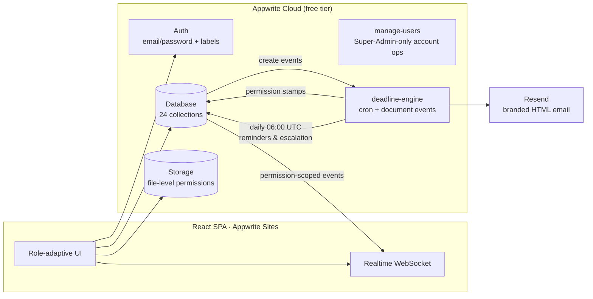

<div align="center">


# AQCMS — Academic Quality & Compliance Management System

**A full-stack quality-assurance platform for the APIIT School of Computing** — replacing the shared-drive folder maze with role-based dashboards, digitised subject files, automated approval chains, deadline tracking, and a tamper-evident audit trail, aligned with the APIITEMS Procedure Manual (ISO 21001:2018).

[](https://aqcms-soc.appwrite.network)


</div>

---

## ✨ Highlights

| | |
|---|---|
| 🔐 **8 role-based dashboards** | Lecturer, Module Leader, Level Coordinator, Internal Verifier, Moderator, Academic Administrator, Head of School, Super Admin — each with a unique, purpose-built home view |
| 🔁 **Configurable approval workflows** | Multi-stage chains (Lecturer → Verifier → Module Leader → Level Coordinator → HOD) with evidence uploads, return-for-revision, resubmission, HOD override, and a visual stage timeline |
| ⏰ **Deadline engine** | Procedure-manual rules ("subject file due 9 weeks before semester start") resolve into per-person tasks; a scheduled function sends 7/3/1-day reminders and **auto-escalates to the HOD** after 3 days overdue |
| 📁 **Digitised subject files** | Document checklists per subject (IVF, Module Descriptor, assessments, mark grids) with upload **versioning**, per-slot review, and **restricted exam-paper slots** enforced at the storage layer |
| 🔔 **Realtime + email** | WebSocket-pushed notifications (live bell counter, toasts — no refresh) and branded HTML emails for every event, signed by the Head of Computing |
| 🕵️ **Tamper-evident audit trail** | Append-only action log — nobody, at any permission level short of the server key, can edit or delete history |
| 🧾 **One-click reporting** | Live compliance tables with CSV export — the replacement for the manual Subject File Tracker spreadsheet |
| 🔒 **Confidential modules** | Cases (mentoring / EC / academic conduct) visible only to creator + HOD; appraisals visible only to HOD + the staff member — the Super Admin is architecturally excluded |

---

## 🖥 Live demo

**https://aqcms-soc.appwrite.network** — password for all demo accounts: `Apiit@123`

| Account | Role | What to look at |
|---|---|---|
| `hod@apiit.lk` | **Head of Computing** (Dr. Chaman Wijesiriwardana) | Command view: compliance ring, per-level heatmap, escalations, governance, appraisals |
| `superadmin@apiit.lk` | Super Admin | Control centre: user management, structure setup, workflow templates, deadline rules |
| `lecturer@apiit.lk` | Lecturer | Submissions, tasks, returned items, subject-file uploads |
| `moduleleader@apiit.lk` | Module Leader | First-line approvals + module cards |
| `levelcoord@apiit.lk` | Level Coordinator | Level-scoped queue and compliance |
| `verifier@apiit.lk` | Internal Verifier | IVF verification queue |
| `moderator@apiit.lk` | Moderator | Cycle-scoped moderation cases |
| `acadadmin@apiit.lk` | Academic Administrator | Delegated structure data entry |

> **Realtime demo:** open two windows (one incognito), log in as `moduleleader` and `lecturer`, submit a Lesson Sequence Sheet as the lecturer — and watch the module leader's bell tick up with a toast, no refresh.

---

## 🏗 Architecture



**Security model** (the interesting part):

- Roles are **Appwrite user labels** — settable only server-side, so they're tamper-proof and usable in collection permission rules.
- Browsers can only grant document permissions to *their own identity*, so all cross-user grants (notification recipients, task owners, HOD case oversight, appraisal staff access, restricted-file reviewer access) are **stamped server-side by an event-triggered function** within ~1s of creation.
- The evidence bucket has **no bucket-level read** — every file carries its own ACL, which is how restricted exam papers stay invisible to non-reviewers.
- The audit trail collection grants **create-only** to users: no update, no delete, for anyone.

---

## 🚀 Getting started

```bash
git clone https://github.com/nimshafernando/APIIT-Academic-Quality-Compliance-Management-System.git
cd APIIT-Academic-Quality-Compliance-Management-System
npm install
cp .env.example .env        # fill in your Appwrite endpoint, project ID, API key
npm run setup               # provisions DB, 24 collections, bucket, 2 functions
npm run seed                # demo accounts + structure + sample data
npm run dev                 # http://localhost:5173
```

| Script | Purpose |
|---|---|
| `npm run setup` | Idempotent backend provisioning (database, collections + indexes, storage, functions, env vars) |
| `npm run seed` | Idempotent demo data (8 accounts, academic structure, templates, in-flight workflows, tasks, cases…) |
| `npm run smoke` | 38 integration tests against the live backend |
| `node scripts/e2e.mjs` | 49 deep end-to-end tests — full lifecycles + security edge cases, self-cleaning |
| `npm run deploy` | Build + deploy the SPA to Appwrite Sites |
| `node scripts/test-email.mjs` | Fire a test notification → verifies the email pipeline end-to-end |

**Email setup (optional):** create a free [Resend](https://resend.com) key and set `RESEND_API_KEY` in `.env` before `npm run setup`. Until a sending domain is verified, set `EMAIL_DEMO_REDIRECT` to your own address — every email arrives there with a note showing the intended recipient.

---

## 🧪 Testing — 87 automated tests

The test suites run against the **live** backend using real user sessions per role, and clean up after themselves:

- **Full workflow lifecycle** — submit → verify → approve → *return with mandatory comment* → resubmit → approve → HOD sign-off, driven by five different user sessions
- **Confidentiality proofs** — Super Admin cannot read cases or appraisals; unrelated staff can't see each other's tasks, cases, or restricted files; moderators can't open exam papers
- **Immutability** — audit-trail update/delete blocked, version history locked
- **Deadline engine** — reminder dedupe, overdue flagging, HOD escalation exactly once
- **Auth edges** — wrong/weak passwords, invalid roles, duplicate emails, self-deactivation, deactivated-account login all rejected

---

## 📚 Modules

| Module | SRS coverage |
|---|---|
| Approval Workflow Engine | WF-01 … WF-06 (incl. HOD reassign/override) |
| Deadline & Task Engine | TASK-01 … TASK-04, NOTIF-01/02 |
| Subject Files (document slots + versions) | DOC-01 … DOC-07 |
| Academic Structure (Year → Programme → Level → Semester → Intake → Module → Offering → Subject) | STR-01 … STR-06 |
| Support & Case Management | SUP-01 … SUP-03 |
| Governance (risk register, committee minutes, document store) | GOV-01 … GOV-03 |
| Staff Appraisals | APR-01 … APR-03 |
| Reporting & Audit (CSV export) | RPT-01 / RPT-02 |
| Accounts & RBAC (bulk CSV import, scoped time-bound assignments) | ADM-01 … ADM-06, AUTH-01/02/03/05/06 |

---

## 🗂 Project structure

```
├── src/
│   ├── components/      app shell, icon set, UI primitives
│   ├── context/         auth session + roles
│   ├── lib/             appwrite client, workflow engine, task engine, structure config
│   └── pages/           dashboards, workflows, subject files, tasks, cases,
│                        governance, appraisals, reports, admin
├── functions/
│   ├── manage-users/    Super-Admin-only account operations (Appwrite Function)
│   └── deadline-engine/ cron reminders + event-driven permission stamping + email
└── scripts/             setup · seed · smoke · e2e · deploy · test-email
```

---

<div align="center">
<sub>Built for the APIIT School of Computing · APIITEMS Procedure Manual (ISO 21001:2018)</sub>
</div>
